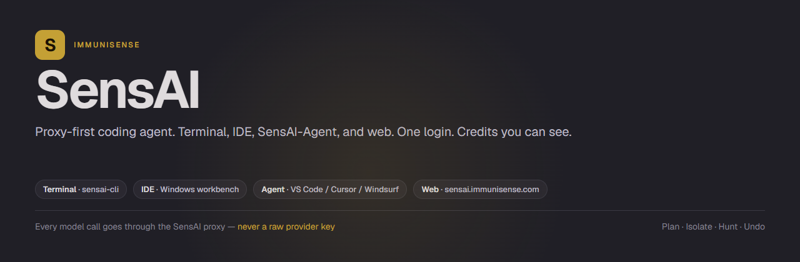
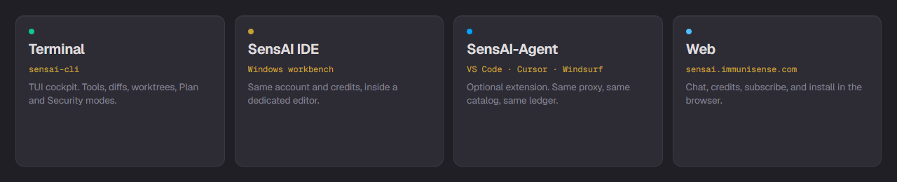
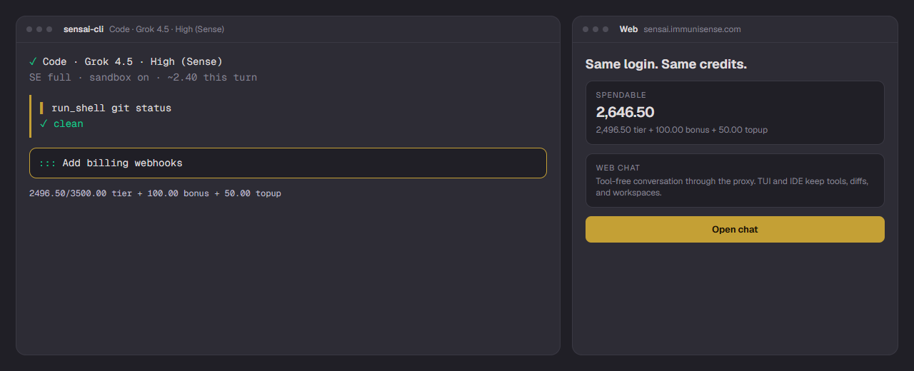
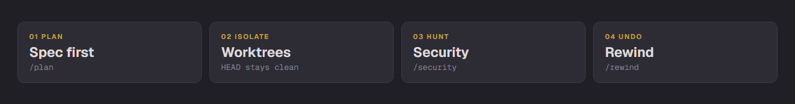
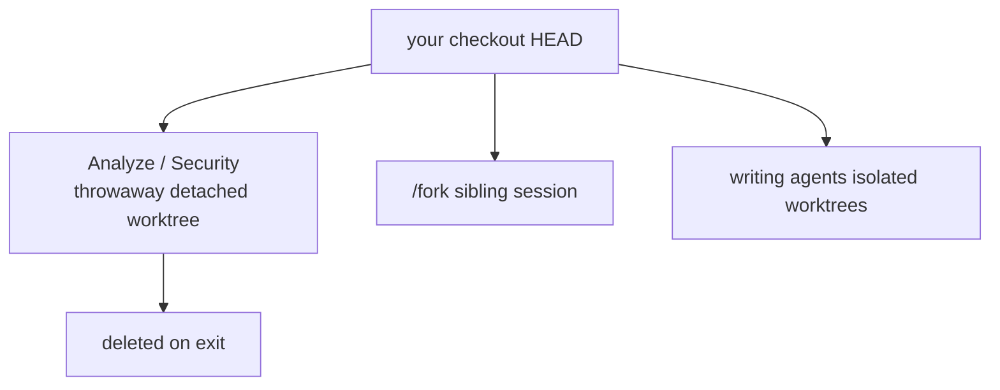
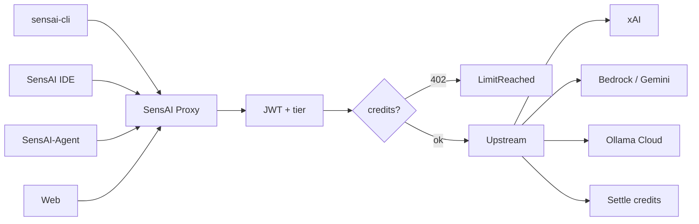

<div align="center">



**Proxy-first coding agent.** Terminal (`sensai-cli`), SensAI IDE, SensAI-Agent in VS Code / Cursor / Windsurf, and web at [sensai.immunisense.com](https://sensai.immunisense.com/). One login, many models, credits you can see.

This repository is **docs and issues**. Source is proprietary. Binaries come from the proxy, not from GitHub Releases.

[](https://sensai.immunisense.com/)
[](https://sensai.immunisense.com/install)
[](https://github.com/immunisense/sensai/issues/new/choose)
[](LICENSE.md)

[Install](#installation) · [Quick start](#quick-start) · [Modes](#modes) · [Security Mode](#security-mode) · [Models](#model-catalog) · [Billing](#billing) · [Issues](#issues)

</div>



| Surface | Where | Issues |
|---------|--------|--------|
| **Terminal** | `sensai-cli` TUI | [`cli`](https://github.com/immunisense/sensai/issues?q=label%3Acli) |
| **SensAI IDE** | Windows workbench | [`ide`](https://github.com/immunisense/sensai/issues?q=label%3Aide) |
| **SensAI-Agent** | [VS Code / Cursor / Windsurf](https://marketplace.visualstudio.com/items?itemName=IMMUNISENSECORP.sensai-ide) | [`extension`](https://github.com/immunisense/sensai/issues?q=label%3Aextension) |
| **Web** | [sensai.immunisense.com](https://sensai.immunisense.com/) | [`web`](https://github.com/immunisense/sensai/issues?q=label%3Aweb) |

Every model call goes through the SensAI proxy — never a raw provider key.



---

## Quick start

**Unix**

```bash
curl -fsSL https://sensai.immunisense.com/install | bash
sensai-cli auth login
sensai-cli
```

**Windows**

```powershell
irm https://sensai.immunisense.com/install.ps1 | iex
sensai-cli auth login
sensai-cli
```

**Web** — open [sensai.immunisense.com](https://sensai.immunisense.com/), sign in, chat. Tools, diffs, and workspaces stay on the TUI and IDE.

```text
$ sensai-cli auth login
✓ Browser OAuth  →  JWT in OS keyring

$ sensai-cli
✓ Code  ·  Grok 4.5  ·  High (Sense)
  SE full  ·  sandbox on  ·  ~2.40 this turn
```

```bash
sensai-cli plan "Add billing webhooks"
sensai-cli analyze "Where is JWT refresh handled?"
sensai-cli run --json "List the public HTTP routes"
sensai-cli workspace init
sensai-cli workspace add ../other-repo --name other
```

---

## Installation

| | |
|---|---|
| **curl** | `curl -fsSL https://sensai.immunisense.com/install \| bash` |
| **Windows** | `irm https://sensai.immunisense.com/install.ps1 \| iex` |
| **Web** | [sensai.immunisense.com](https://sensai.immunisense.com/) — chat, credits, subscribe, docs |
| **SensAI IDE** | Windows installer from [immunisense.com/solutions/sensai](https://immunisense.com/solutions/sensai) |
| **SensAI-Agent** | [Marketplace](https://marketplace.visualstudio.com/items?itemName=IMMUNISENSECORP.sensai-ide) — VS Code, Cursor, Windsurf |

Installers download checksum-verified binaries from the proxy.

```bash
sensai-cli update    # checksum-verified from the proxy
```

The TUI shows **Update now** when a newer version is available.

---

## Isolation



Agents cannot quietly damage HEAD, credentials, or the working tree.



| Layer | What it does |
|-------|----------------|
| **Git worktrees** | Analyze and Security never write HEAD. `/fork` binds a sibling tree. |
| **OS sandbox** | `run_shell` on macOS and Linux. Credential paths denied. |
| **Path guards** | Tools stay inside the workspace. |
| **Secrets scanner** | 30+ patterns before a turn leaves the machine. |
| **Checkpoints** | `/rewind` restores the last turn. |
| **Proxy** | All LLM traffic → `https://sensai.immunisense.com`. No raw provider keys. |

---

## Modes

| Mode | How | Behaviour |
|------|-----|-----------|
| **Code** | `sensai-cli` | Full tools, edits, shell, LSP, MCP. |
| **Plan** | `sensai-cli plan` or `/plan` | Spec-driven: requirements → design → tasks → approval. |
| **Chat** | `/chat` or [web](https://sensai.immunisense.com/chat) | Conversation only. No tools. |
| **Analyze** | `sensai-cli analyze` or `/analyze` | Read-only in a throwaway worktree. |
| **Design** | `/design` | Architecture / DESIGN.md. No shell. |
| **Security** | `/security` | Sense Protocol hunt. Read-only. Sense Pro + security add-on. |

`Shift+Tab` cycles Code ↔ Plan. Analyze and Security are explicit so you cannot drop into a write mode by accident.

---

## Security Mode

Class-by-class defensive hunt. Same contract on every catalog model.

```text
SCOPE → RECON → MAP → HUNT → VALIDATE → REPORT
                         7-question gate
```

AuthZ, JWT, injection, SSRF, secrets, path traversal, XSS, CSRF, uploads, business logic, OAuth, supply chain, LLM/MCP, billing integrity, admin authz — **file:line evidence, no exploit payloads**.

Product reports: **security@immunisense.com**. See [`SECURITY.md`](SECURITY.md).

---

## Session verbs

| Command | What happens |
|---------|----------------|
| `/rewind` `/fork` `/replay` `/pr` | Undo, clone+worktree, re-run, open a PR |
| `/sense-engineer` | Talk packing + YAGNI ladder (`light`/`full`/`ultra`/`auto`) |
| `/compact` | Summarize and continue |
| `/security` | Security Mode (if entitled) |

```bash
sensai-cli checkpoints list
sensai-cli run --json "…"
```

---

## Authentication

Browser OAuth. CLI and IDE store tokens in the OS keyring (macOS Keychain, Windows Credential Manager, Linux `libsecret` / `pass`). Web uses an HttpOnly `sensai_session` cookie — never `localStorage`.

```bash
sensai-cli auth login
sensai-cli auth status
sensai-cli auth logout
```

---

## Model catalog

Free tier: Grok Build and Gemma 4. Paid tiers can use every catalog model.

| Model | Provider | Context | Notes |
|-------|----------|---------|-------|
| Grok Build | xAI | 256K | Free |
| Grok 4.5 | xAI | 500K | Sense ≥200K |
| Grok 4.3 | xAI | 1M | Sense ≥200K |
| Grok 4.6 | xAI | 500K | Sense ≥200K |
| Claude Sonnet 5 / Opus 5 | Anthropic | 1M | Adaptive thinking |
| Claude Fable 5.1 | Anthropic | 1M | Adaptive thinking |
| GPT-6 Astra / GPT-5.6 Sol · Terra · Luna | OpenAI | 1.05M | |
| GLM-5.3 / Flash | Z.ai | 1M | |
| Kimi K3 | Moonshot | 1M | |
| MiniMax M3 | MiniMax | 512K | |
| DeepSeek V4 Flash / Pro | DeepSeek | 1M | |
| Gemma 4 | Google | 256K | Free |
| Gemini 3.8 Flash | Google | 1M | Thinking low/medium/high |

**Sense Mode:** `/sense` for full context at higher per-token rates.

1 credit = $0.04. Local tools are $0 extra.

---

## Billing

**tier → bonus → top-up**. HTTP 402 opens subscribe or top-up. Same ledger on CLI, IDE, Agent, and web.

| Tier | Price | Monthly credits |
|------|-------|-----------------|
| Free | $0 | 50 |
| Pro | $20 | 500 |
| Ultra | $40 | 1,250 |
| Sense | $100 | 3,500 |
| Sense Pro | $200 | 7,500 |
| Sense Ultra | $400 | 16,000 |

Security Mode is a paid add-on on Sense Pro and Sense Ultra.

```bash
sensai-cli credits
sensai-cli topup
sensai-cli billing portal
```

Or manage credits in the [web account](https://sensai.immunisense.com/).

---

## Architecture



No raw provider credentials on the client.

---

## Docs

[`docs/web.md`](docs/web.md) · [`docs/plan_mode.md`](docs/plan_mode.md) · [`docs/mcp.md`](docs/mcp.md) · [`docs/formatter.md`](docs/formatter.md) · [`docs/custom_agents.md`](docs/custom_agents.md) · [`docs/lsp.md`](docs/lsp.md) · [`docs/profiles.md`](docs/profiles.md) · [`SECURITY.md`](SECURITY.md) · [`CONTRIBUTING.md`](CONTRIBUTING.md)

---

## Issues

Use a template so the right label is applied:

[CLI bug](https://github.com/immunisense/sensai/issues/new?template=bug-cli.yml) · [IDE bug](https://github.com/immunisense/sensai/issues/new?template=bug-ide.yml) · [Extension bug](https://github.com/immunisense/sensai/issues/new?template=bug-extension.yml) · [Web bug](https://github.com/immunisense/sensai/issues/new?template=bug-web.yml) · [Feature](https://github.com/immunisense/sensai/issues/new?template=feature.yml)

Vulnerabilities: **security@immunisense.com** — never a public issue.

---

<div align="center">

**Proprietary.** All rights reserved by Immunisense Corp.

[App](https://sensai.immunisense.com/) · [Product](https://immunisense.com/solutions/sensai) · [Website](https://immunisense.com) · [Changelog](CHANGELOG.md)

</div>
